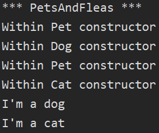

:sectnums:
:nofooter:
:toc: left
:icons: font
:data-uri:
:source-highlighter: highlightjs
:stem: latexmath

= Inh.02 -- Pets & Fleas

We are keeping cats & dogs as pets.
Sometimes those are infested by fleas, who bite them.

== Specification

.Class Diagram
[plantuml]
----
@startuml
hide empty methods

class Cat {
    -bool _isOnTree
    +int TreesClimbed [private set]

    +Cat()
    +bool ClimbOnTree()
    +bool ClimbDown()
    +string ToString() [override]
}
class DateTimeProvider {
    -DateTime? _overrideDateTime
    +DateTime Now
}
class Dog {
    {static} -TimeSpan huntingWaitInterval [readonly]
    -DateTimeProvider _dateTimeProvider [readonly]
    -DateTime? _lastHuntedTime
    +int HuntedAnimals [private set]

    +Dog(DateTimeProvider)
    +bool HuntAnimal()
    +string ToString() [override]
}
class Flea {
    +Pet? CurrentPet [private set]
    +int TotalBites [private set]

    +void JumpOnPet(Pet?)
    +int BitePet(int)
    +string ToString() [override]
}
abstract class Pet {
    {static} +int NextPetId [private set]
    +int PetId [readonly]
    +int RemainingBites [private set]

    #Pet()
    +int GetBitten(int)
    {static} #void PrintCtorInfo(string)
}

Pet <|-- Cat
Pet <|-- Dog
Dog *-- DateTimeProvider
Flea o-l- Pet

@enduml
----

=== Pet

* Every animal kept as a pet is... a pet
* Each pet has a unique id
** This is assigned upon creation
** The next id is the previous +1
* A pet can be bitten at most 100 times (then it is out of blood 🧛)

=== Cat

* A cat is a pet
* It can climb on trees
** It cannot climb two trees at the same time
* And it can climb down from a tree
** If it was up on a tree
* It represents itself as `I'm a cat`

=== Dog

* A dog is a pet
* It can go on the hunt for animals
** Between hunts, it has to rest for at least one minute
* It represents itself as `I'm a dog`

=== Flea

* A flea is _not_ a pet
* It can jump on pets and bite them
* It can switch to other pets or even none
* It represents itself as `I'm a flea`

== Tasks

. Implement the necessary classes and logic to fulfill the requirements
** Extensive unit tests have been provided to guide you
*** Make sure to use the correct names for classes, methods and properties to ensure that those will work with your implementation
** Mind the class diagram and specification above
. Create full XMLDoc for your code
. Ensure that the provided `Program` produces the following output

.Sample Run

WARNING: Unit tests & `Program` logic are commented to ensure the solution compiles -- enable them as needed while your implementation extends