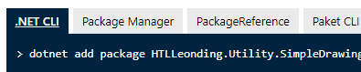
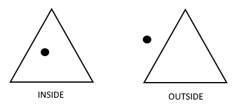

:sectnums:
:nofooter:
:toc: left
:icons: font
:data-uri:
:source-highlighter: highlightjs
:stem: latexmath

= Inh.03 -- Shapes

* This time, we are drawing colorful shapes 🤩
* For this job you will _add a NuGet package_ yourself
* You will be free to come up with your own application structure and inheritance hierarchy -- only the requirements are given in this document
* A starter project and some code to help you to work with the graphics package is available

NOTE: That means that neither unit tests nor a class diagram could be provided, you are on your own!

== General Requirements

. Display a white canvas to the user
. When the user clicks on the canvas:
.. If the space is empty a shape is rendered at this location -- with the click position becoming the center point of the new shape
.. If a shape is already present at this location it gets removed
. New shapes are created in the following, circular order:
.. Square
.. Circle
.. Rectangle
.. Triangle
. For new shapes color and size are chosen randomly
.. Size has to be constrained to the boundaries of the canvas (= don't draw outside)
.. The triangle is equilateral
.. For the rectangle both width and height are chosen randomly which can lead to a larger height than width => the rectangle is rendered in vertical orientation
. New shapes get assigned a unique, incrementing ID
. The final application should work like in the following sample run

.Sample Run
video::sample_run.mp4[Sample Run,width=600]

== Tasks

Every shape has:

* Several common properties:
.. An ID
.. A center point (x,y)
.. A color
* Two common functionalities:
.. It can _draw itself_ on the canvas
.. It can tell you if a point (x,y) is _contained_ within the area of the shape

WARNING: The provided parts of `Program` & `ShapeGenerator` assume that there is a class `Shape` => if you use different names make sure to change the provided code accordingly

=== Class Diagram

* Your first job is to _come up with an inheritance hierarchy_
** Think about which features are shared and which differ between our four shapes
** Make good choices for _visibility_
** Ensure to properly mark classes as `abstract` or `sealed`, as required
* Then create the appropriate class diagram

=== Implementation Requirements

==== Adding Graphics Package

* For this assignment we will be using the https://www.nuget.org/packages/HTLLeonding.Utility.SimpleDrawing[HTLLeonding.Utility.SimpleDrawing] package
** We already discussed why it makes a lot of sense to combine various packages (_libraries_) when creating applications -- don't reinvent the wheel all the time, but rely on _standard_ libraries when possible
* That is a https://learn.microsoft.com/en-us/nuget/[NuGet] package -- take the time to read up on what that is
* To be able to use it in your program you have to _add_ it as a _dependency_ to the project
* Luckily the NuGet package of the package already shows you various 'copy & paste' ways of adding the package
** 
** Decide on one of the options (switch between them using the tabs)
* On the NuGet page of the package you will also find some documentation about the package and some _sample usage_
** Because the package was created by a _good_ developer (😎) it also comes with XML documentation your IDE will display as well as https://learn.microsoft.com/en-us/dotnet/core/diagnostics/symbols[symbols] which your IDE can use when you debug the code
** => we always want to do our work properly and make life easier (instead of harder) for everyone!
* Basic setup for using the package has already been done for you (in `Program`)
** You may especially ignore `async` & `await` for the time being, those are just needed due to some threading magic going on behind the scenes -- we will learn about that next year
** Look for the `TODO` so know where to put your own code

IMPORTANT: Before adding the package successfully the starter code will _not_ compile!

==== Functionality

* You _have_ to use inheritance
* Make sure to avoid code duplication wherever possible in a sensible way
* Use the same color for both the borderline and the fill content
* Sizes are generated in the following boundaries:
** Rectangle: width or height 10-150
** Triangle: side length 10-150
** Circle: radius 5-100
** Square: side length 10-120
* Size may have to be reduced if the user clicked close to the border of the canvas, we don't want to draw outside the canvas
* It is necessary to know if a point lies within the area of a shape, because we have to know _if_ and _which_ shape the user clicked (or if the click hit empty canvas)
** 
* If two shapes overlap the click 'hits' the one 'on top' => the one added _later_
* Actions (adding or removing a shape) are logged to the console

=== Testing

* Determine which parts of your application can be tested by unit tests and which don't
** Write down your conclusions!
* Create unit tests for those parts which can be unit tested in a meaningful way

== Implementation Hints

Here are a couple hints that may help you implement the required functionality.

* You can use these colors:

[source,csharp]
----
private static readonly IBrush[] colors =
    {
        Brushes.Blue,
        Brushes.Cyan,
        Brushes.DarkGreen,
        Brushes.Firebrick,
        Brushes.Lime,
        Brushes.Orange,
        Brushes.Plum,
        Brushes.Yellow
    };
----

* The following function can be used to determine if a point lies on the right hand side of an edge (be careful with clockwise or counter-clockwise edge iteration):

[source,csharp]
----
private static bool IsOnRightSideOfEdge(Point edgeStart, Point edgeEnd, Point pointToCheck)
{
    double d = (edgeEnd.X - edgeStart.X) * (pointToCheck.Y - edgeStart.Y)
               - (pointToCheck.X - edgeStart.X) * (edgeEnd.Y - edgeStart.Y);

    return d > 0D;
}
----

* A (filled) triangle cannot be drawn by using three lines, because then you won't be able to fill it. Instead, you may use the `SimpleDrawing.DrawPolygonByPath` method.

